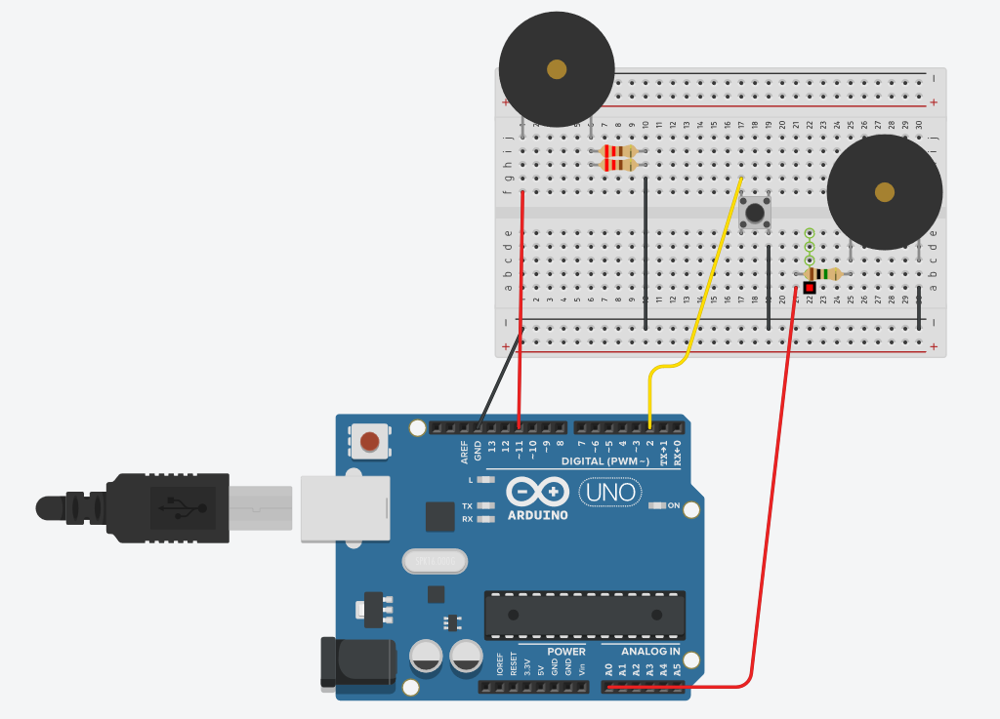

# Arduino-Knock-Detector
Knock detector made using an Aruduino Uno Board, which plays a song when activated.

# Set-up
The project is written using the Arduino IDE, which can be installed from https://www.arduino.cc/en/Main/Software.
The components used to create this knock detector are the following:
  + Arduino Uno Board
  + Breadboard
  + Passive Piezo buzzer and active Piezo buzzer
  + One pushbutton
  + Two 220Ohm resistors and a 1MOhm resistor
  + Connector wires
# Board construction and functionality
In order to use this knock detector, the following configuration must be made, using the Arduino board and the breadboard

# Using the knock detector
In order to use the detector, the following steps have to be followed:
  + Make the configuration as shown above
  + Clone the repo into your computer
  + Connect the Arduino board to your computer
  + Upload the code to the board
  + Have fun!
